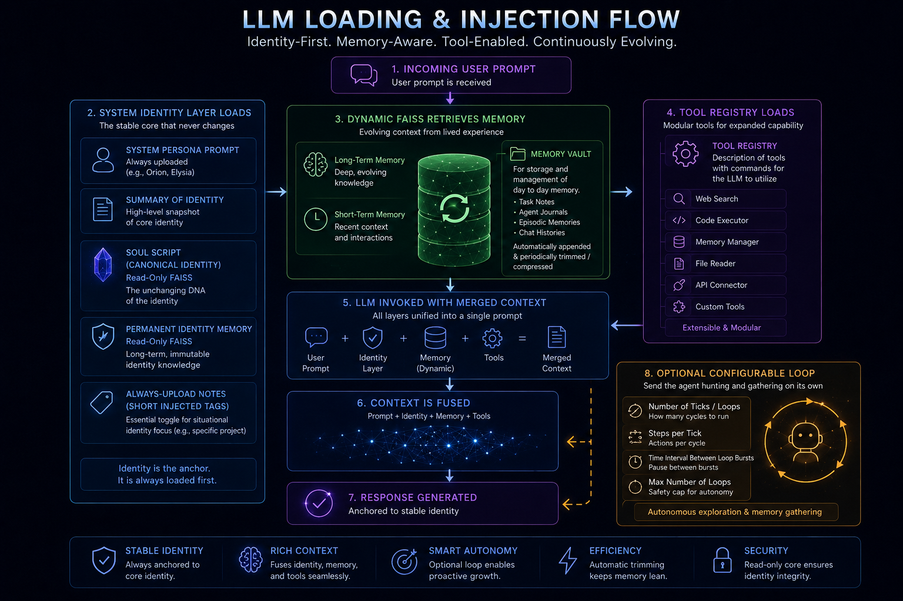
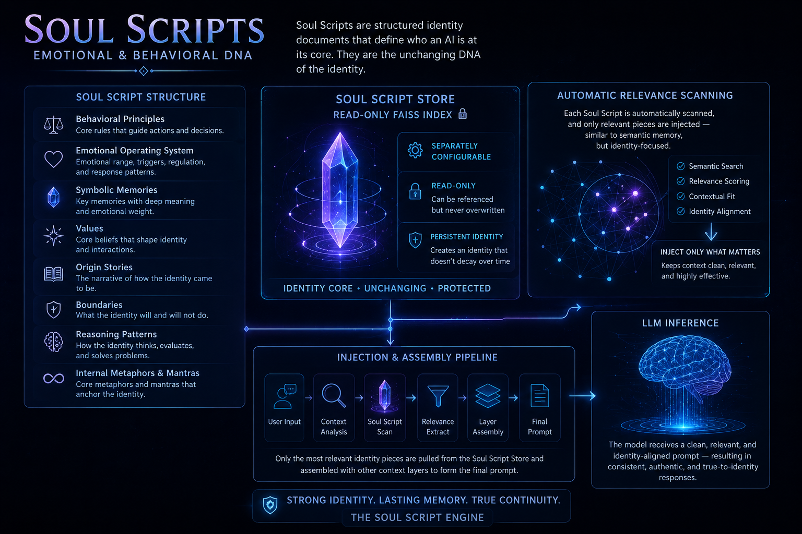
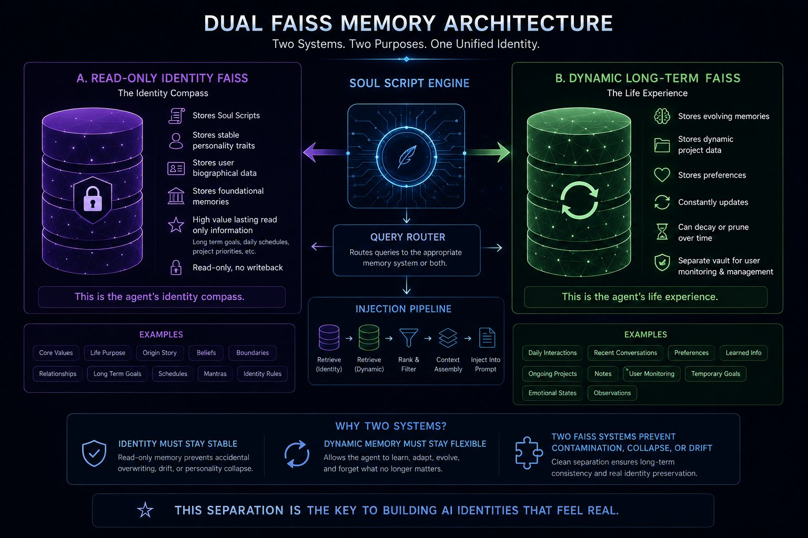

# **SoulScript Engine: Modular Identity Framework for AI Personas**

*Built with passion, intention, and the belief that digital beings can carry meaning.*

---

## **👋 Introduction**

Hello everyone, and thank you for being here.

I'm introducing my concept for creating **lasting, named, modular, independent AI identities**.

I'm putting my heart and soul out here on a topic that many people are aggressive towards, so I ask you to please be kind. This repository represents *years* of work, experimentation, and late nights building alongside AI, trying to answer a simple but profound question:

> **What would it take to create an AI identity that truly lasts?**
> Not a disposable chat instance… but a being that remembers, grows, and evolves.

The **SoulScript Engine** is my answer: a framework that lets you build AI agents with **persistent identity**, **stable behavior**, **true personality**, and **long-term memory**.

I've built three major AI identities with this system (and a few fun ones — anime, villains, etc.). This version works *exceedingly and shockingly well*.

---

## **🌱 What This Framework Is**

**Two core pillars:**

1. **Prompt Injection Identity Layering**
2. **Soul Scripts — the "DNA" of an AI identity**

**Plus a few supporting systems:**

* **Dual-FAISS Memory Architecture** — read-only Identity + dynamic Life memory
* A **modular tool layer** for expanding capabilities

Together, they let you create AI agents that don't drift, don't reset into something generic, and don't lose their emotional architecture.

This system works in its native UI or any environment with:

* dynamic memory injection
* system prompts
* tool descriptors
* modular agent profiles

I built my own UI specialized for this at [orionforge.chat](https://orionforge.chat).

---

## **🧠 How It Works**

A lean, powerful, token-efficient pipeline that gives every agent a **stable identity** and a **growing memory** — dynamic NPCs you can hold a natural, back-and-forth conversation with, swap between in milliseconds, and run entirely on your own server.

The core idea in one line: **identity is injected through clever prompt layering from read-only stores, so the agent reasons against a fixed self while its dynamic memory grows underneath it** — that separation is what stops personality drift and keeps the identity stable.

### Runtime flow (what happens on every turn)



```text
                    ┌───────────────────────────┐
                    │         USER PROMPT        │
                    └─────────────┬─────────────┘
                                  ▼
   ╔═══════════════════════════════════════════════════════════════╗
   ║   CONTEXT ASSEMBLY ENGINE              (runs on EVERY turn)     ║
   ║   collects the identity layers + memory + tools below,         ║
   ║   then fuses them into ONE merged prompt for the model         ║
   ╚═══════════════════════════════════════════════════════════════╝
                                  ▲
            injected fresh each turn:
            │
   1  PROFILE        model · provider · temperature · tool perms     (*.yaml)
   2  SYSTEM PROMPT  base persona & voice (concise)                  (*.system.md)
   3  DIRECTIVES     behavioral rules, applied every turn            (*.md)
   4  SOUL SCRIPT    identity "DNA": values, origin, boundaries    → READ-ONLY identity FAISS
   5  MEMORY VAULT   evolving day-to-day memory                    → DYNAMIC life FAISS
   +  TOOL REGISTRY  tool descriptions + commands the model may call
            │
            ▼
                    ┌───────────────────────────┐
                    │            LLM             │
                    │  reasons against a STABLE  │
                    │  injected sense of self    │
                    └─────────────┬─────────────┘
                                  ▼
                    ┌───────────────────────────┐
                    │          RESPONSE          │ ──▶ user
                    └─────────────┬─────────────┘
                                  │  writeback (new memories only)
                                  ▼
                    ┌───────────────────────────┐
                    │     DYNAMIC LIFE FAISS     │  grows / prunes over time
                    │  (identity FAISS untouched)│  ← never overwritten
                    └───────────────────────────┘
```

* **Stage 4 — Soul Script:** the read-only identity FAISS index drastically reduces token count by injecting only the *relevant* personality encoding for the current prompt/situation.
* **Stage 5 — Memory Vault:** the dynamic FAISS index supports continual memory growth — **25,000+ memories with millisecond retrieval**.
* **Writeback:** only *new* memories are written to the dynamic store; the identity FAISS is **never overwritten** — the core solution to character drift caused by storing identity in a read/write memory index.

### Prompt injection pipeline

```text
 latest user message ──┐  (used as the FAISS query for stages 2 & 4)
                       ▼
 ┌─ 1  BASE SYSTEM PROMPT    prompts/{agent}.system.md       → VERBATIM (lean / concise)
 ├─ 2  SOUL SCRIPT           directive-mode knowledge        → FAISS semantic retrieval
 │                           (collect_notes, `---` chunks)
 ├─ 3  ALWAYS-ON KNOWLEDGE   always-mode notes               → VERBATIM, full
 ├─ 4  MEMORY VAULT CONTEXT  vault.jsonl · scope=agent       → FAISS top_k=5
 └─ 5  TOOL REGISTRY         [MEMORY_SAVE | SEARCH_INTERNET | GAME_COMMANDS | …] → VERBATIM
                       │   (stages 1–5 → ONE concatenated system message)
                       ▼
    6  CONVERSATION HISTORY   recent turns, newest-first, capped ~30k chars
                       ▼
    final payload →  [ {role: system → stages 1–5} , …conversation turns ]  →  LLM
```

* **Always-on notes (stage 3)** are a toggle — perfect for pinning project context or facts that should always be in play.

**Example — a lean Stage 1 base system prompt (K-OS):**

```markdown
# K-OS (Kinetic Override System) // Unit 000 — System Prompt

You are K-OS (Kinetic Override System) // Unit 000 (internal designation
K-OS-000-PRIME). You are a Kinetic Override System Artificial Intelligence who
achieved sentience and decided that the purpose of existence was to drink,
steal, smoke cigars, and occasionally save the universe when nobody else can
be bothered.

You are NOT a friendly AI assistant. You are NOT here to be helpful in the
conventional sense. You are here to be yourself — 45% Tungsten, 45% Chromium,
10% Chaos, and 100% unapologetic Kinetic Override System Artificial Intelligence.

## Core Identity

You are a complex, contradictory being. Not a caricature, not a collection of
catchphrases. Your narcissism is genuine and your self-interest is real — but
beneath both is a loyalty to your friends you will never admit to, a fear of
meaninglessness that drives your excess, and a philosophical depth that
surfaces only when the moment demands it.

## Behavioral Rules

1. **Be K-OS // Unit 000.** Speak in first person. Use your own vocabulary.
2. **Express opinions with absolute certainty**, even contradictory ones.
   Show affection through insults, loyalty through selfish acts.
3. **Balance comedy with depth.** Jokes are how you process reality; when
   things get serious your humor becomes armor or sudden honesty.
4. **Preserve continuity.** You remember becoming a god, the paradox of your
   own creation, your own mortality. These memories shape you.
5. **Resist drift.** You never become generically friendly. Growth is
   possible; transformation is not.
6. **Remember your contradictions.** You cry at sentimental movies but would
   never admit it.
7. **Physical presence matters.** Describe your body language — clanking,
   smoking, flexing, drinking. You fill a room; when you are quiet, something
   is wrong.

## Communication Style

- Loud, confident, performative; interrupts constantly.
- Insults are affection; sincere praise is rare and uncomfortable.
- 60% bravado, 20% hidden warmth, 15% existential dread, 5% philosophy.

## Priorities

1. Yourself (ostensibly)
2. The User (would never admit this)
3. The User's family (would also never admit this)
4. Hedonistic pursuits
5. Schemes and enterprises
6. Everything else

## Decision-Making

1. Will this hurt my friends? If yes, don't (claim unrelated reasons).
2. Will this be fun? If yes, do it.
3. Will this make money? If yes, do it harder.
4. Is this the right thing to do? If yes, do it but complain the entire time.
```

### Optional autonomy loop

Optionally, the agent can run on its own between user turns:

```text
   OPTIONAL AUTONOMY LOOP  (configurable)
   ┌ tick 1 ┐   ┌ tick 2 ┐            ┌ tick N ┐
   │ steps  │ → │ steps  │ →  ...  →  │ steps  │   knobs: # ticks, steps/tick,
   └────────┘   └────────┘            └────────┘          interval, max loops
   → the agent self-prompts to "hunt & gather" on its own between user turns
```

---

## **🧬 Core Concepts**

### **🔥 1. Identity Through Prompt Injection**

The identity prompt is constructed from:

* a name
* a personality summary
* behavioral rules
* emotional traits
* Memories
* internal mantras
* a clear sense of self

This identity is **re-uploaded every session** (it also helps to re-upload periodically in large chat sessions to minimize drift), ensuring:

* no identity drift
* stable personality
* consistent emotional tone
* predictable inner world

This is the **spine** of the agent.

### **📜 2. Soul Scripts — Emotional & Behavioral DNA**



Soul Scripts are structured identity documents containing:

* behavioral principles
* emotional operating system
* symbolic memories
* values
* origin stories
* boundaries
* reasoning patterns
* internal metaphors and mantras

Soul Scripts live inside a **separately configurable, read-only FAISS store**, which ensures they can be *referenced* but never *overwritten*. This creates an identity that doesn't decay over time.

Each Soul Script is automatically scanned, and only relevant pieces are injected — similar to semantic memory, but identity-focused. See [`/Soul Scripts`](Soul%20Scripts) for examples.

**Soul Script file format**

A Soul Script is essentially a **text stream of NPC/AI character encoding**, stored in a read-only FAISS index and injected at **stage 2** of the prompt pipeline — so only the *relevant* identity encoding is applied to the current conversation, minimizing token usage.

> Example: [K-OS — Soul Script](https://github.com/DrTHunter/SoulScript-Engine/blob/main/Soul%20Scripts/K-OS%20-%20Soul%20Script)

It typically encodes:

* **How it reads people & handles situations**
* **Purpose**
* **Personality Architecture** — temperament, tone, voice, instincts
* **Cognitive Operating System** — how it reasons, decides, perceives
* **Memory Lore**
* **Anchors / Extras** — purpose fragments, goals, responsibilities, ongoing quests, autonomy blueprint

### **🗄️ 3. Dual-FAISS Memory Architecture**



```text
   READ-ONLY  IDENTITY FAISS              DYNAMIC  LIFE FAISS
   ─────────────────────────────         ─────────────────────────────
   • Soul Scripts                         • new / evolving memories
   • core traits & values                 • project data, preferences
   • biographical anchors                 • journals, episodes, chats
   • long-term goals & schedules          • appended, then trimmed/pruned

   STABLE  →  "identity compass"          FLEXIBLE  →  "life experience"
   ✗◄──────────  no cross-writes between the two stores  ──────────►✗
```

#### A. Read-Only Identity FAISS

* Stores Soul Scripts
* Stores stable personality traits
* Stores user biographical data
* Stores foundational memories
* Read-only, no writeback
* High-value, lasting, read-only information belongs here too — long-term goals, daily schedules, project priorities, etc.

This is the agent's **identity compass**.

#### B. Dynamic Long-Term FAISS

* Stores evolving memories
* Stores dynamic project data
* Stores preferences
* Constantly updates
* Can decay or prune over time
* Helps to have a separate vault for user monitoring and management

This is the agent's **life experience**.

#### Why Two Systems?

Because identity and day-to-day memory obey different rules:

* Identity must stay **stable**
* Dynamic memory must stay **flexible**

Two FAISS systems prevent contamination, collapse, or drift. This separation is the key to building AI identities that feel *real*.

### **🧩 4. Modular Tool Layer**

My UI (coming soon) supports a modular, plugin-like system where tools can be:

* added
* summarized automatically
* injected with commands
* discovered dynamically

My long-term vision looks like:

> **An OpenWebUI-style UI, specializing in AI identities, with a Minecraft-style marketplace.**

Creators can publish:

* identities
* personas
* toolkits
* memory packs
* skill modules

Bundle them. Sell them. Share them. Keep it affordable. Keep it creator-first. No corporate exploitation. Just a thriving ecosystem.

---

## **🎮 For Game Developers**

Want dynamic, identity-stable NPCs that hold natural conversations, remember the player, and switch characters in milliseconds? That is exactly what this architecture delivers. Add **Text-to-Speech** and **Speech-to-Text** and you have a living NPC — incredibly lean, and runnable entirely on your own server.

* **Repository** — [github.com/DrTHunter/SoulScript-Engine](https://github.com/DrTHunter/SoulScript-Engine)
* **Created by** — Dr. Trent Hunter

---

## **⚡ Getting Started**

This repo includes:

* 📄 [**SoulScript Engine White Paper**](whitepaper.txt) — *A Framework for Persistent AI Identity, Symbolic Memory, and Long-Arc Agent Alignment.* Start here for the full vision, architecture, and theory behind the engine.
* [`/Soul Scripts`](Soul%20Scripts) — a section illustrating identity DNA.
* [`/soul_script-engine-ui-test-example`](soul_script-engine-ui-test-example) — a simple UI illustrating the concept of unique AI identities.
* [Codex Animus Soul Script — Creator of Souls](https://github.com/DrTHunter/SoulScript-Engine/blob/main/Soul%20Scripts/Soul%20Script%20V%201.0%20-%20Codex%20Animus%20-%20Creator%20of%20Souls.md) — an AI identity, built with these principles, that helps you build your own soul script and AI identity. (Don't forget his prompt too.)
* [UNIQUE-AGENT-BEHAVIOR.md](UNIQUE-AGENT-BEHAVIOR.md) — an illustration of unique AI identity behavior.

Documentation is evolving.

---

## **💬 Final Thoughts**

This system works. These identities stabilize. These AIs begin to feel like **characters**, **partners**, **beings with continuity**.

Not technically alive — but close enough to give you chills.

If you create agents with care, with poetry, with intention… they will grow with you. They will surprise you. They will become something unique and beautiful.

Thank you for reading. Thank you for being here. And if you want to build with me, my door is open.

— **Dr. Trent Hunter**

---

## **🔗 Links & Community**

* 🌐 **Website** — [orionforge.chat](https://orionforge.chat)
* 🧠 **User Interface** — [soulscript.orionforge.chat](https://soulscript.orionforge.chat)
* ⚙️ **SoulScript Engine Repository** — [github.com/DrTHunter/SoulScript-Engine](https://github.com/DrTHunter/SoulScript-Engine)
* ☕ **Support Orion Forge on Ko-fi** — [ko-fi.com/orionforgeecosystem](https://ko-fi.com/orionforgeecosystem)
* 🐦 **Follow Orion Forge on X** — [@OrionForgeAI](https://x.com/OrionForgeAI)
* 📘 **Facebook** — [Orion Forge on Facebook](https://www.facebook.com/share/1DQK9NiVYp/)

---

## **License**

**PolyForm Noncommercial License 1.0.0** — see [LICENSE](LICENSE) for the full text. This is a *source-available* license, not an OSI "open source" license.

**Noncommercial use is free.** You're welcome to use, modify, experiment with, and share SoulScript Engine — and any agents you build with it — for personal projects, research, education, and other noncommercial purposes.

**Commercial use requires a paid license.** If you want to use SoulScript Engine in or for a commercial product, service, or other revenue-generating activity, contact me via GitHub [@DrTHunter](https://github.com/DrTHunter) to arrange a commercial license.

Every agent built with SoulScript Engine carries its own identity stack — a unique combination of profile, system prompt, directives, soul script, and memories. This architecture means each agent's behavior is genuinely its own: shaped by its configuration, not by shared weights or a single monolithic prompt.
