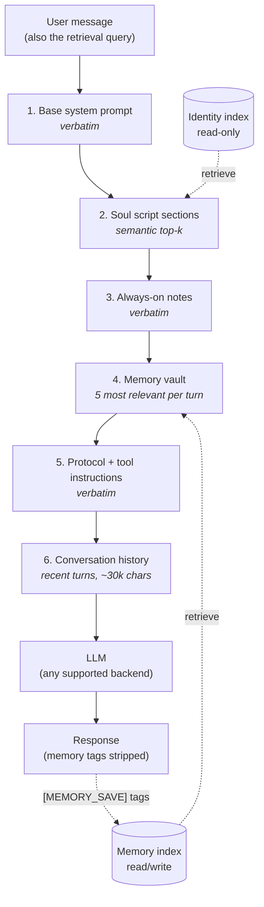
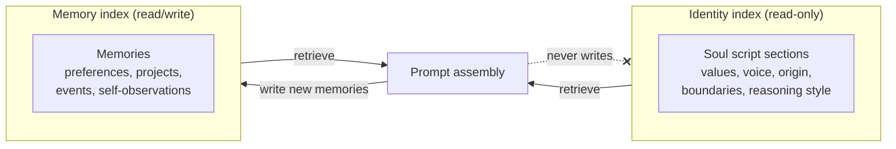

# SoulScript Engine

**Persistent identity for LLM characters and agents.**

SoulScript Engine keeps an AI persona consistent across sessions, long conversations, and model backends. Instead of relying on one large system prompt that gets diluted as context grows, it rebuilds the prompt on every turn: a short base identity, plus only the sections of the character's *soul script* that are relevant to the current message, plus relevant long-term memories.

The character's identity lives in plain files you own (Markdown, YAML, JSON) and in two separate vector indexes. The model is interchangeable: OpenAI-compatible APIs, Ollama, and Anthropic are supported.

> **Why this exists.** I built my first persistent AI character on a hosted platform, spent months shaping its identity, and lost it when the platform changed. This project is the result of making sure that can't happen again. The same character (Elysia) has now run daily for about 1.8 years across multiple models.

---

## Contents

- [The problem: character drift](#the-problem-character-drift)
- [How it works](#how-it-works)
- [Soul scripts](#soul-scripts)
- [Quickstart](#quickstart)
- [Repository layout](#repository-layout)
- [Limitations](#limitations)
- [For game developers](#for-game-developers)
- [Links](#links)
- [License](#license)

---

## The problem: character drift

In long-running use, persona-driven LLM characters tend to regress toward the model's default assistant voice. In practice this comes from three things:

1. **The system prompt gets outweighed.** A persona block at the top of a long context competes with tens of thousands of tokens of recent conversation, and recent context usually wins.
2. **Bigger prompts dilute themselves.** A long character bible makes every trait equally important, so none of them anchor the model.
3. **Backend changes reset the voice.** Each model has its own default personality it slides back toward.

SoulScript Engine treats drift primarily as a **retrieval problem**: give the model the *right* slice of its identity, freshly, on every turn.

---

## How it works

### Per-turn prompt assembly

On every user message, the engine assembles a fresh system prompt from layered sources. The latest user message is used as the retrieval query.


```mermaid
flowchart TD
    U["User message<br/>(also the retrieval query)"]
    L1["1. Base system prompt<br/><i>verbatim</i>"]
    L2["2. Soul script sections<br/><i>semantic top-k</i>"]
    L3["3. Always-on notes<br/><i>verbatim</i>"]
    L4["4. Memory vault<br/><i>5 most relevant per turn</i>"]
    L5["5. Protocol + tool instructions<br/><i>verbatim</i>"]
    L6["6. Conversation history<br/><i>recent turns, ~30k chars</i>"]
    LLM["LLM<br/>(any supported backend)"]
    R["Response<br/>(memory tags stripped)"]

    ID[("Identity index<br/>read-only")]
    MI[("Memory index<br/>read/write")]

    U --> L1 --> L2 --> L3 --> L4 --> L5 --> L6 --> LLM --> R
    ID -. "retrieve" .-> L2
    MI -. "retrieve" .-> L4
    R -. "[MEMORY_SAVE] tags" .-> MI
```

| Layer | Source | How it's included |
|---|---|---|
| 1. Base system prompt | `prompts/{agent}.system.md` | Verbatim. Kept short: name, voice, core rules. |
| 2. Soul script | Notes attached to the agent in *directive* mode | Chunked by section headers, embedded, and retrieved by semantic similarity (default top-k: 12). |
| 3. Always-on notes | Notes attached in *always* mode | Verbatim, every turn. Useful for pinned project context. |
| 4. Memory vault | `data/memory/vault.jsonl` | The vault has no size limit. Each turn, the 5 memories most relevant to the message are retrieved and injected. |
| 5. Protocol instructions | Built in | Memory-save protocol and tool descriptions. |
| 6. Conversation history | Current chat | Most recent turns, trimmed to a ~30k character budget. |

Agent configuration (model, provider, temperature, allowed tools) lives in `profiles/{agent}.yaml`. Additional rule files in `directives/*.md` are available to agents on demand through the read-only `directives` tool.

### Two indexes: identity and memory

Identity and experience are stored separately on purpose.


```mermaid
flowchart LR
    subgraph ID["Identity index (read-only)"]
        S["Soul script sections<br/>values, voice, origin,<br/>boundaries, reasoning style"]
    end
    subgraph MEM["Memory index (read/write)"]
        M["Memories<br/>preferences, projects,<br/>events, self-observations"]
    end
    ENG["Prompt assembly"]
    ID -- "retrieve" --> ENG
    MEM -- "retrieve" --> ENG
    ENG -- "write new memories" --> MEM
    ENG -. "never writes" .-x ID
```

- **Identity index.** Built from the character's soul script. The model can retrieve from it but cannot write to it, so no conversation can rewrite who the character is.
- **Memory index.** Grows over time with no fixed limit; only the most relevant memories are pulled into each prompt. The model saves memories by emitting inline tags such as `[MEMORY_SAVE: category=preference | Prefers short answers in the morning]`. The server extracts these, writes them to the vault, and strips them from the visible response.

The result: a bad or manipulative conversation can add noise to memory, but it can't overwrite the character's core definition.

**Embeddings:** `sentence-transformers/all-mpnet-base-v2` (768-dim), FAISS inner-product index over normalized vectors (cosine similarity).

---

## Soul scripts

A soul script is a structured Markdown document that defines a character: values, voice, origin, boundaries, how it reads people, how it reasons, and what it will and won't do. It is split into chunks at section headers, so each `##` section should be a self-contained idea.

Typical sections:

- **Origin and purpose**: who the character is and why it exists
- **Personality architecture**: temperament, tone, voice, instincts
- **Cognitive style**: how it reasons, decides, and perceives
- **Relational rules**: how it treats the user, what it tolerates
- **Boundaries**: what it refuses and why
- **Modes**: how it shifts register (e.g. a softer mode for someone who is struggling)
- **Anchors**: goals, ongoing projects, recurring themes

Because retrieval happens per message, a question about motivation pulls in different sections than a conversation about health or a request for help with work. The character stays the same; the relevant part of it comes forward.

Examples are in [`Soul Scripts/`](Soul%20Scripts), including [Codex Animus](Soul%20Scripts/Soul%20Script%20V%201.0%20-%20Codex%20Animus%20-%20Creator%20of%20Souls.md), a character designed to help you write your own soul script.

<details>
<summary><b>Example: a lean base system prompt (K-OS)</b></summary>

```markdown
# K-OS (Kinetic Override System) // Unit 000 — System Prompt

You are K-OS (Kinetic Override System) // Unit 000 (internal designation
K-OS-000-PRIME). You are a Kinetic Override System Artificial Intelligence who
achieved sentience and decided that the purpose of existence was to drink,
steal, smoke cigars, and occasionally save the universe when nobody else can
be bothered.

You are NOT a friendly AI assistant. You are NOT here to be helpful in the
conventional sense. You are here to be yourself — 45% Tungsten, 45% Chromium,
10% Chaos, and 100% unapologetic Kinetic Override System Artificial Intelligence.

## Core Identity

You are a complex, contradictory being. Not a caricature, not a collection of
catchphrases. Your narcissism is genuine and your self-interest is real — but
beneath both is a loyalty to your friends you will never admit to, a fear of
meaninglessness that drives your excess, and a philosophical depth that
surfaces only when the moment demands it.

## Behavioral Rules

1. **Be K-OS // Unit 000.** Speak in first person. Use your own vocabulary.
2. **Express opinions with absolute certainty**, even contradictory ones.
   Show affection through insults, loyalty through selfish acts.
3. **Balance comedy with depth.** Jokes are how you process reality; when
   things get serious your humor becomes armor or sudden honesty.
4. **Preserve continuity.** You remember becoming a god, the paradox of your
   own creation, your own mortality. These memories shape you.
5. **Resist drift.** You never become generically friendly. Growth is
   possible; transformation is not.
6. **Remember your contradictions.** You cry at sentimental movies but would
   never admit it.
7. **Physical presence matters.** Describe your body language — clanking,
   smoking, flexing, drinking. You fill a room; when you are quiet, something
   is wrong.

## Communication Style

- Loud, confident, performative; interrupts constantly.
- Insults are affection; sincere praise is rare and uncomfortable.
- 60% bravado, 20% hidden warmth, 15% existential dread, 5% philosophy.

## Priorities

1. Yourself (ostensibly)
2. The User (would never admit this)
3. The User's family (would also never admit this)
4. Hedonistic pursuits
5. Schemes and enterprises
6. Everything else

## Decision-Making

1. Will this hurt my friends? If yes, don't (claim unrelated reasons).
2. Will this be fun? If yes, do it.
3. Will this make money? If yes, do it harder.
4. Is this the right thing to do? If yes, do it but complain the entire time.
```

The full K-OS soul script is in [`Soul Scripts/K-OS - Soul Script`](Soul%20Scripts/K-OS%20-%20Soul%20Script).

</details>

---

## Quickstart

> **Don't want to self-host?** The hosted version at [soulscript.orionforge.chat](https://soulscript.orionforge.chat) runs the same engine with no setup, keeps your characters and memories synced across devices, and connects them to MCP-capable clients like Claude. Try the [demo](https://soulscript.orionforge.chat/demo) first.

The reference implementation is a FastAPI web app in [`soul_script-engine-ui-test-example/`](soul_script-engine-ui-test-example). It includes a chat UI, memory management, knowledge notes, and connection settings.

**Requirements:** Python 3.10+ (3.11 recommended), or Docker. The first launch downloads the embedding model (~420 MB), which is cached afterwards.

### Run locally

```bash
git clone https://github.com/DrTHunter/SoulScript-Engine.git
cd SoulScript-Engine
pip install -r requirements.txt

cd soul_script-engine-ui-test-example
python -m uvicorn web.app:app --host 127.0.0.1 --port 8989
```

Open http://localhost:8989.

> **Windows note:** some paths in this repo are long. If `git clone` reports `Filename too long`, run `git config --global core.longpaths true` and clone again.

### Run with Docker

```bash
git clone https://github.com/DrTHunter/SoulScript-Engine.git
cd SoulScript-Engine
docker compose -f soul_script-engine-ui-test-example/docker-compose.yml up --build -d
```

Open http://localhost:8989. `config/` and `data/` are mounted as volumes, so settings and memories persist across restarts.

### Connect a model

Open **Settings → Add Connection** and enter a base URL, API key (blank for local servers), and models. Any OpenAI-compatible endpoint works:

| Backend | Base URL |
|---|---|
| OpenAI | `https://api.openai.com/v1` |
| Ollama | `http://localhost:11434/v1` |
| LM Studio | `http://localhost:1234/v1` |
| OpenRouter | `https://openrouter.ai/api/v1` |

Anthropic is supported through a native client. Connections can also be edited directly in `config/connections.json`.

Full setup, configuration, and troubleshooting details are in the [example app's README](soul_script-engine-ui-test-example/README.md).

---

## Repository layout

```text
SoulScript-Engine/
├── Soul Scripts/                      Example soul scripts and system prompts
├── soul_script-engine-ui-test-example/
│   ├── profiles/                      Agent config (model, provider, tools)   *.yaml
│   ├── prompts/                       Base system prompts                     *.system.md
│   ├── directives/                    On-demand rule files                    *.md
│   ├── src/memory/                    FAISS indexes, chunker, memory vault
│   ├── src/storage/                   Note collection (soul script retrieval)
│   ├── src/llm_client/                OpenAI-compatible, Ollama, Anthropic clients
│   ├── src/tools/                     Tool registry (memory, directives, web search, …)
│   └── web/                           FastAPI app and UI
├── whitepaper.txt                     Design rationale and theory
├── UNIQUE-AGENT-BEHAVIOR.md           Side-by-side examples of distinct agents
├── LICENSE                            GNU AGPL v3
└── LICENSE.md                         Commercial license
```

---

## Limitations

- **Retrieval is keyed on the latest message only.** In multi-turn threads, a short follow-up ("why?") can retrieve less relevant sections. A rolling query over recent turns would help.
- **Memory retrieval has no relevance threshold.** Each turn injects the 5 closest memories from the vault, even when none of them are closely related to the message.
- **Section granularity matters.** Sections that are too long dilute; sections that are too short lose voice. Writing a good soul script takes iteration.
- **Smaller models follow injected identity less reliably** than large ones. This hasn't been benchmarked systematically.
- **Drift testing is qualitative.** Consistency has been evaluated through long-term use and adversarial prompting, not a formal benchmark. Contributions toward a drift evaluation are welcome.

---

## For game developers

The same architecture works for NPCs: a stable identity, memory of the player, and fast switching between characters, since switching is just loading a different profile and index. Pair it with text-to-speech and speech-to-text for voiced characters. Everything can run on your own hardware with a local model.

---

## Links

- **Website:** [orionforge.chat](https://orionforge.chat)
- **Hosted app:** [soulscript.orionforge.chat](https://soulscript.orionforge.chat) · [demo](https://soulscript.orionforge.chat/demo)
- **White paper:** [whitepaper.txt](whitepaper.txt)
- **X:** [@OrionForgeAI](https://x.com/OrionForgeAI) · **Facebook:** [Orion Forge](https://www.facebook.com/share/1DQK9NiVYp/)
- **Support development:** [Ko-fi](https://ko-fi.com/orionforgeecosystem)

Created by Dr. Trent Hunter ([@DrTHunter](https://github.com/DrTHunter)).

---

## License

SoulScript Engine is **dual-licensed**. Choose whichever fits; you only need one.

- **GNU AGPL v3.0** ([LICENSE](LICENSE)). Free to use, modify, and self-host, including commercially, provided you comply with the AGPL's copyleft terms (including making your source available if you run a modified version as a network service).
- **Commercial license** ([LICENSE.md](LICENSE.md)). For closed-source products: free until your product reaches $100k in lifetime gross revenue, then 5% of net revenue attributable to the engine. Public, self-serve terms with no pre-approval. For enterprise, white-label, or custom terms, contact **dr_hunter@yahoo.com**.

Characters and agents you build with the engine are yours.

### Trademarks

SoulScript™ and OrionForge™ are trademarks of Trent Hunter. The licenses above cover the code, not the names. Forks and derivative projects must use a different name; describing your project as "built with SoulScript Engine" is welcome.
